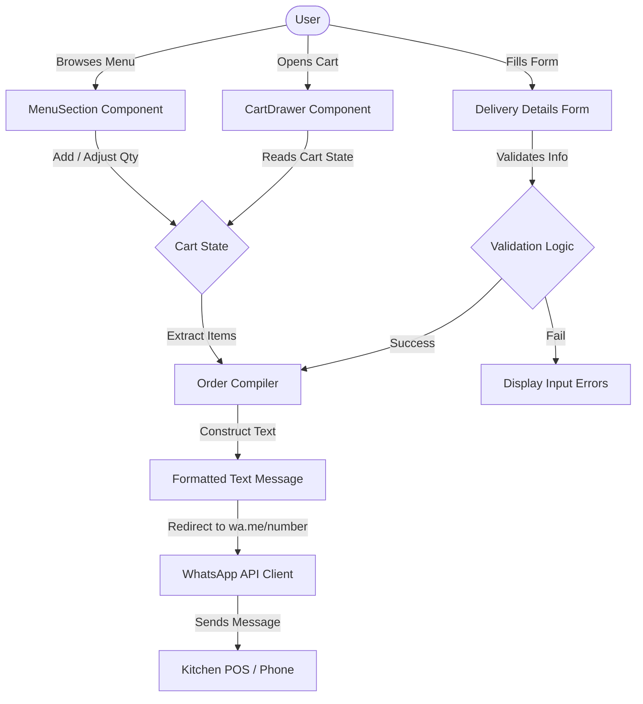

# System Architecture — BurgerBite

BurgerBite is a lightweight, high-performance, direct-to-consumer ordering website designed to bypass third-party food delivery platforms and allow consumers to order directly from the kitchen via WhatsApp.

---

## 1. System Design & User Flow

The application is structured as a client-side single-page app (SPA) built using Next.js (App Router). Since it has no backend database, the entire checkout and order placement process is powered by a WhatsApp message redirection scheme.



---

## 2. Directory Layout & Core Files

The Next.js codebase is organized as follows:

```
nextjs-source/
├── app/                  # Next.js App Router files
│   ├── globals.css       # Font imports, Tailwind directive, custom scrollbars
│   ├── layout.js         # Root HTML layout and metadata configuration
│   └── page.jsx          # Main page component (holds root state)
├── components/           # UI Component catalog (Framer Motion enabled)
│   ├── CartDrawer.jsx    # Slide-out cart drawer & delivery details form
│   ├── Footer.jsx        # Footer disclaimer and brand links
│   ├── Header.jsx        # Sticky navigation header & live cart indicator
│   ├── Hero.jsx          # Hero section with Spline 3D viewport placeholder
│   ├── MenuSection.jsx   # Tabbed category menu layout & food cards
│   └── WhyOrderDirect.jsx# Marketing & value proposition cards
├── lib/                  # Shared data and utility libraries
│   └── menuData.js       # Complete menu schema (54 items), constants, formatting
├── public/               # Static assets
│   └── menu/             # Target folder for real food photographs
├── package.json          # Node project manifest (Next.js v16.2.10, Tailwind v4)
└── jsconfig.json         # Module resolution mapping (@/* path aliases)
```

---

## 3. Component Details & Roles

| Component | File Path | Responsibilities & Features |
| :--- | :--- | :--- |
| **Root Page** | [`app/page.jsx`](file:///d:/Antigravity%20Files/Hitebar%28burger%20shop%29/burgerbite-nextjs-source/nextjs-source/app/page.jsx) | Holds reactive states (`cart`, `customer`, `activeCategory`), defines quantity actions, handles form validation, and generates the final WhatsApp message string. |
| **Header** | [`components/Header.jsx`](file:///d:/Antigravity%20Files/Hitebar%28burger%20shop%29/burgerbite-nextjs-source/nextjs-source/components/Header.jsx) | Sticky layout, dynamic cart indicator with scale animations using Framer Motion. |
| **Hero** | [`components/Hero.jsx`](file:///d:/Antigravity%20Files/Hitebar%28burger%20shop%29/burgerbite-nextjs-source/nextjs-source/components/Hero.jsx) | Primary branding screen with a smooth-scroll button and placeholder viewport for Spline 3D assets. |
| **Why Order Direct** | [`components/WhyOrderDirect.jsx`](file:///d:/Antigravity%20Files/Hitebar%28burger%20shop%29/burgerbite-nextjs-source/nextjs-source/components/WhyOrderDirect.jsx) | Marketing section illustrating cost savings (10% off) and delivery freshness. |
| **Menu Section** | [`components/MenuSection.jsx`](file:///d:/Antigravity%20Files/Hitebar%28burger%20shop%29/burgerbite-nextjs-source/nextjs-source/components/MenuSection.jsx) | Filter tabs by category, card grid rendering. Uses `<PlaceholderArt />` as fallback before real photos are loaded. |
| **Cart Drawer** | [`components/CartDrawer.jsx`](file:///d:/Antigravity%20Files/Hitebar%28burger%20shop%29/burgerbite-nextjs-source/nextjs-source/components/CartDrawer.jsx) | Side panel controlled by Framer Motion. Displays item summary, delivery input fields, totals breakdown, and the final WhatsApp check out button. |

---

## 4. State Management & Order Compilation

### A. Cart State
The shopping cart state is represented as a plain object mapping item IDs to quantity values:
```javascript
const [cart, setCart] = useState({}); // e.g., { "b1": 2, "r14": 1 }
```

React's `useMemo` hooks derive:
- **`cartItems`**: Resolves the IDs in the state against the reference dictionary inside [`lib/menuData.js`](file:///d:/Antigravity%20Files/Hitebar%28burger%20shop%29/burgerbite-nextjs-source/nextjs-source/lib/menuData.js).
- **`subtotal` / `total`**: Computed on the fly using `price` fields and the `DELIVERY_FEE` constant.

### B. Validation & Redirection
Before checkout is initiated, the application checks if the user's name, phone, and address are filled. If valid, the checkout compiler creates a formatted order message:

```javascript
const message = `🍔 *NEW BURGERBITE DIRECT ORDER!* 🍦
----------------------------------
*Customer:* ${customer.name}
*Phone:* ${customer.phone}
*Delivery Address:* ${customer.address}

*Order Items:*
${itemLines}

----------------------------------
*Subtotal:* ₹${formatINR(subtotal)}
*Delivery Fee:* ₹${DELIVERY_FEE}
*Total Amount:* ₹${formatINR(total)}
----------------------------------
⚡ *Please confirm this order and share the payment link!*`;
```

The message is URL-encoded and dispatched via:
```javascript
window.open(`https://wa.me/${STORE_WHATSAPP}?text=${encoded}`, "_blank");
```

---

## 5. Styling and Design Tokens

The site applies a dark-themed UI featuring custom typography and bright accents:
- **Backgrounds**: Slate-black (`#121212` / `#161616` / `#1A1A1A`)
- **Primary Accent**: Brand Orange (`#FF6B00`)
- **Success Accent (WhatsApp)**: Green (`#25D366`)
- **Fonts**: 
  - Display headers: *Plus Jakarta Sans*
  - Body text: *Inter*
- **Grid Patterns & Accents**: Pre-rendered CSS gradients inside `<PlaceholderArt />` dynamic tiles represent categories visually until real photographs are ready.
